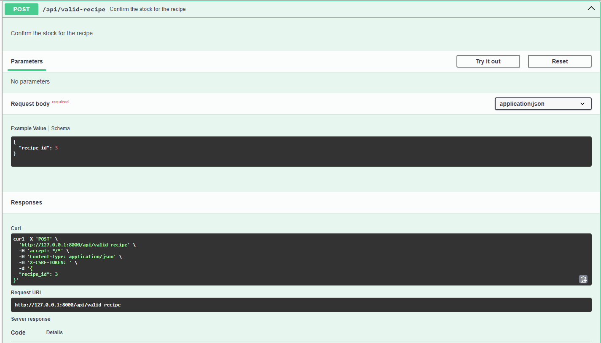

<h1>Documentation API - GESTION STOCK ALIMENTAIRE -</h1>
 

<h4>Display recipe possible :</h4>

<h4>Valid Recipe :</h4>

<h4>Display Stock with products :</h4>

<h4>Interface for add stock :</h4>

URL : http://127.0.0.1:8000/api/stock/create

